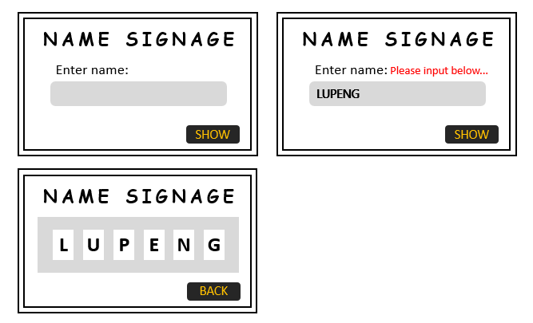
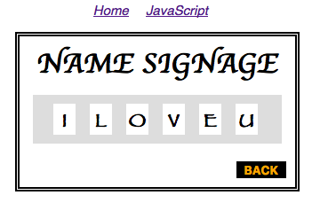

title: Day8 JavaScript学习 - 名牌示例
date: 2016-01-06
categories: JavaScript
tags: [名牌示例]
---

又学习了一段时间JavaScript，今天来实现一个简单的示例，展示名牌，自己YY出来的一个简单例子。需求大概这样：

- 在输入框中输入名字，限定长度为6位的字母；
- 提交按钮，将6位字符串分开；
- 文本框一些交互

说起来很枯燥，下面是我在PPT上画的大概样式：

  

虽然是自己YY出来的题目，涉及到的内容基本是之前学习过的知识点；既然是学习`JavaScript`，只说`JavaScript`部分，虽然好看不好看主要还是要看`css`功底。当然最重要的是要有丰富的想象力。

JavaScript使用到的知识并不多，也基本上之前学到过的，比如：

1. `String`对象的简单应用
3. `DOM`节点的操作
4. `DOM`事件增加交互

> 实现

首先要根据PPT的图形，将页面框架写出来，也就是`HTML`和`CSS`，页面很简单，就一个文本框，一个按钮；

```html
<div id="container">
	<div id="form_title">NAME SIGNAGE</div>
	<div id="form_content">
		<div id="text"><span>Enter name:</span><span id="error"></span></div>
		<div id="input"><input type="text" id="name" value="Please input your name"></div>
	</div>
	<div id="form_footer">
		<input type="submit" id="button" value="SHOW" onclick="showTime()">
	</div>
</div>
```

然后就是根据按钮的动作，完成主体代码，点击按钮，调用`showTime()`函数；

```javascript
function showTime(){
	checkName();
	var error = document.getElementById("error");
	if (error.innerHTML != '') return false; // 如果有错误信息，不执行按钮操作
	var container = document.getElementById("container");
	var form_footer = document.getElementById("form_footer");
	var form_content = document.getElementById('form_content');
	var name = document.getElementById("name").value.toUpperCase();
	var letters = name.split('');
	form_content.style.display = 'none';
	var form_content2 = document.createElement("div");
	form_content2.setAttribute("id","form_content2");
	container.insertBefore(form_content2,form_footer);
	for (var i = 0; i < letters.length; i++) {
		var elementCube = document.createElement("div");
		elementCube.setAttribute("class","cube");
		elementCube.innerHTML = letters[i];
		form_content2.appendChild(elementCube);
	}
	var button = document.getElementById("button");
	button.value = "BACK";
	button.setAttribute("onclick","backToHome()");
}
```

最后对文本控件做一些用户交互，提高体验，也就是DOM事件里的一些内容，比如`focus`文本框的时候，隐藏默认`value`；还有文本框内容的一些验证等等细节。

最终效果如下图，实际演示请[点击这里>>>](../HTML/Day8.html)


