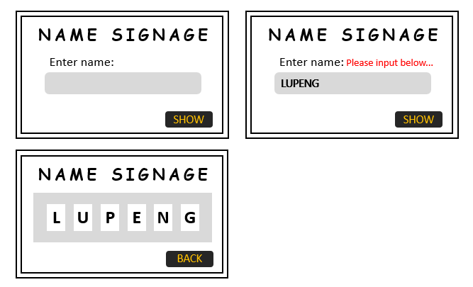

title: Day8 JavaScript学习 - 名牌示例
date: 2016-01-06
categories: JavaScript
tags: [名牌示例]
---

又学习了一段时间JavaScript，今天来实现一个简单的示例，展示名牌，自己YY出来的一个简单例子。需求大概这样：

- 在输入框中输入名字，限定长度为6位的字母；
- 提交按钮，展示名字名牌；
- 文本框一些交互

说起来很枯燥，下面是我在PPT上画的大概样式：

  

虽然是自己YY出来的题目，涉及到的基本知识点基本是之前学习过的知识点；既然是学习JavaScript，只说JavaScript部分，虽然好看不好看主要还是要看css功底，css相关代码。

1. `String`对象的方法
2. `Array`对象的方法
3. `DOM`节点的操作
4. `style`样式修改

基本上还是没有逃脱之前学习过的那些知识点，要实现好看令人吸引的例子，主要还是要靠想象力。好了，先画框架（HTML）；

```
<div id="container">
	<div id="form_title">NAME SIGNAGE</div>
	<div id="form_content">
		<div id="text"><span>Enter name:</span><span id="error"></span></div>
		<div id="input"><input type="text" id="name" value="Please input your name"></div>
	</div>
	<div id="form_footer">
		<input type="submit" id="button" value="SHOW" onclick="showTime()">
	</div>
</div>
```


